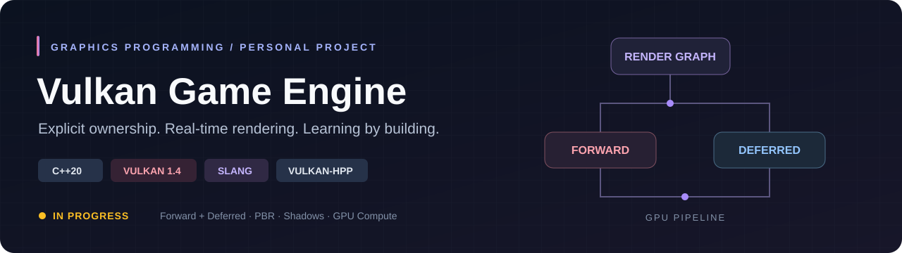
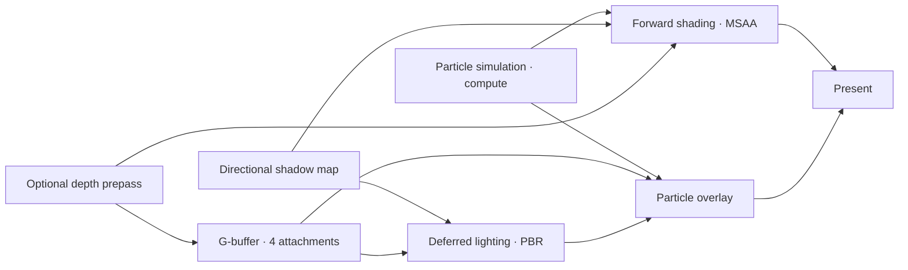

<p align="center">
  
</p>

<p align="center">
  
  
  
  
  
</p>

# Vulkan Game Engine

A personal graphics programming project exploring modern Vulkan and real-time engine development. Built with **C++20, Vulkan 1.4, Vulkan-Hpp, `vk::raii`, and Slang**, it combines selectable Forward and Deferred rendering, physically based materials, shadow mapping, GPU particles, and an explicit render graph.

The project follows the [Khronos Vulkan Tutorial](https://github.com/KhronosGroup/Vulkan-Tutorial) and grows through incremental implementations and experiments. The focus is understanding GPU resource ownership, synchronization, rendering techniques, and engine architecture through working code.

> **In progress.** This is an evolving learning and portfolio project. The published renderer is functional; recent local experiments and the next milestones are listed separately below. It currently implements rasterization and compute workloads; ray tracing and path tracing are future directions.

## Highlights

- **Two rendering paths:** switch between Forward and Deferred rendering at runtime, with an optional depth prepass.
- **PBR materials:** metallic/roughness shading, GGX microfacet distribution, Smith geometry, Schlick Fresnel, and tangent-space normal mapping.
- **Directional shadows:** a dedicated shadow pass, 3 × 3 PCF filtering, and angle-dependent shadow bias.
- **GPU particle simulation:** compute shader updates followed by a graphics pass, with explicit producer/consumer synchronization.
- **Render graph:** declared image and buffer usage, dependency compilation, resource lifetime analysis, and synchronization2 execution.
- **Resource systems:** typed cached handles, reference counting, background loading, shader hot reload, and prioritized file-chunk streaming.
- **Rendering diagnostics:** 15 selectable material and lighting views, render-graph dumps, and Graphviz visualization tooling.

See the [feature inventory](docs/FEATURES.md) for implementation details and source entry points.

## Implemented features

| Area | Published implementation |
| --- | --- |
| Modern Vulkan | Vulkan 1.4 device selection, Vulkan-Hpp, `vk::raii`, dynamic rendering, synchronization2, and validation layers in Debug builds. |
| Frame management | Two frames in flight, per-frame resources, command recording/submission, and swapchain recreation on resize. |
| Forward renderer | Textured meshes, depth testing, hardware-supported MSAA and sample shading, plus an optional depth prepass. |
| Deferred renderer | Four G-buffer attachments, a dedicated lighting pass, and particle composition. |
| Lighting and materials | Directional lighting, metallic/roughness PBR, normal mapping, packed material textures, and AO/emissive material inputs. |
| Shadows | Per-frame shadow-map resources, shadow sampling, 3 × 3 PCF, and minimum/slope-dependent bias. |
| Meshes and textures | OBJ loading, staging uploads, texture decoding, mipmap generation with a CPU fallback, and anisotropic sampling. |
| Compute | GPU particle simulation using storage buffers and a dedicated compute pipeline. |
| Render graph | Typed resources, read/write declarations, inferred and explicit dependencies, execution ordering, lifetime analysis, and graph diagnostics. |
| Graph execution | Physical resource binding, image-layout transitions, and image/buffer barriers through synchronization2. |
| Resource management | Mesh, texture, material, shader, and binary resource types; cached typed handles and reference-counted release. |
| Async, reload, streaming | A background loading worker; file-change polling and pipeline reload callbacks; priority-ordered chunk requests processed with a per-frame budget. |
| Scene system | Scene-owned game objects, components, transforms, cameras, mesh components, directional lights, and lifecycle callbacks. |
| Events and services | Typed scene events, subscriptions, an event bus, and engine service registration. |
| Developer tools | Material debug views, text/DOT graph exports, a Graphviz conversion tool, and resource-manager/render-graph self-tests. |

AO and emissive are material channels and diagnostics; screen-space AO and bloom are not implemented. File-chunk streaming currently runs on the calling thread, independently of the background loader. The graph describes lifetimes; automatic memory aliasing is not implemented.

## Latest work — In progress

The following additions are implemented in the local working tree and are awaiting a separate source publication. They are documented here to make the development status explicit:

- **Free camera:** keyboard movement, yaw/pitch controls, and a sprint modifier.
- **Depth-aware orbit particles:** world-space compute simulation, camera projection, and depth testing in both rendering paths.
- **CPU/GPU profiler:** nested CPU sections, command-recording timings, per-pass GPU timestamps where supported, and configuration summaries.
- **Smoke-test reports:** five Debug/Release rendering cases, validation-log checks, HTML dashboards, timing history, and comparisons against previous runs.
- **Platform events and lifecycle work:** window-event dispatch and additional event-bus/resource-lifetime checks.
- **Presentation controls:** selectable FIFO, Mailbox, and Immediate modes through an environment setting, with supported-mode fallback.
- **Asset exercises:** staged glTF sample assets and an incremental scene-import plan. The runtime loader currently uses OBJ.

## Frame pipeline



The renderer selects one path. Forward draws particles inside the scene rendering scope; Deferred composites them after lighting. The render graph connects resource usage to execution order and barriers.

## Build and run

The checked-in build targets **Windows x64 / Visual Studio 2022**.

1. Install Visual Studio 2022 with the **Desktop development with C++** workload and the v143 toolset.
2. Install a Vulkan SDK with Vulkan 1.4 headers and `slangc`; ensure `VULKAN_SDK` points to that installation.
3. Install [vcpkg](https://github.com/microsoft/vcpkg), enable its Visual Studio integration, and install the dependencies:

   ```powershell
   vcpkg install glfw3:x64-windows glm:x64-windows stb:x64-windows tinyobjloader:x64-windows
   vcpkg integrate install
   ```

4. Open `VulkanGameEngine.sln`, select **Debug / x64**, and build. The project invokes `Shaders/compile.bat` to compile the Slang shaders and copies the GLFW runtime beside the executable.
5. Set the debugger working directory to `$(ProjectDir)` so `Models/`, `Textures/`, and `Shaders/` resolve correctly, then run.

From a Visual Studio Developer PowerShell, you can also run:

```powershell
msbuild .\VulkanGameEngine.sln /m /t:Build /p:Configuration=Debug /p:Platform=x64
.\x64\Debug\VulkanGameEngine.exe
```

**Build portability:** the project uses `VULKAN_SDK` but still includes legacy SDK paths for `C:\VulkanSDK\1.4.341.1`. Check the include/library settings if your installation differs. A clean-machine dependency setup and a portable build configuration are roadmap items.

The selected GPU must support the requested Vulkan features, including dynamic rendering, synchronization2, extended dynamic state, anisotropic sampling, sample-rate shading, and large points. Debug builds enable validation layers and shader hot reload.

## Controls

| Key | Action |
| --- | --- |
| `F6` | Switch Forward / Deferred rendering. |
| `F7` | Toggle the depth prepass. |
| `0` | Lit material. |
| `1` / `2` | World normal / tangent-space normal. |
| `3` / `4` | Roughness / metallic. |
| `5` / `6` | Shadow visibility / albedo. |
| `7` / `8` / `9` | Geometric normal / tangent / shadow depth. |
| `F1` / `F2` / `F3` | Diffuse / specular / Fresnel. |
| `F4` / `F5` | Material AO / emissive. |

Latest local free-camera controls: `W/A/S/D` move, `Q/E` descend/ascend, arrow keys rotate, and `Left Shift` increases speed. Debug-view output can differ between Forward and Deferred because the G-buffer stores a subset of the original geometry data.

## Project structure

```text
Engine/
├── Application/    Entry point, frame loop, configuration and input controllers
├── Platform/       GLFW window and platform integration
├── Vulkan/         Instance, device, queues and one-time command execution
├── Renderer/       Render paths, passes, graph, frame and target resources
├── Resources/      Resource ownership, loading, hot reload and streaming
├── Scene/          Game objects, components, camera and lights
├── Events/         Typed events, subscriptions and dispatch
├── Services/       Engine service registration
└── ThirdParty/     Third-party implementation units
Shaders/            Slang graphics and compute shaders
Models/             OBJ scene assets
Textures/           Material textures
Tools/              Render-graph visualization tooling
```

`Engine/Application/ApplicationEntry.cpp` supplies `main()`. `main_raii.cpp` contains the current application orchestration; the legacy `main.cpp` is retained as reference and is excluded from compilation.

## Small roadmap

- [x] Modern Vulkan foundation with explicit resource ownership.
- [x] Forward/Deferred rendering, PBR, shadows, compute particles, and render-graph execution.
- [ ] **Publish the current iteration:** free camera, depth-aware particles, profiling, and smoke-test tooling.
- [ ] **Lighting parity:** add one point light and verify the same material/light setup in both paths.
- [ ] **Scene import:** start with a small GLB inspector and a minimal mesh/material import, then extend PBR texture support.
- [ ] **Portfolio demo:** add real renderer captures, repeatable performance measurements, asset credits, and a clean-machine build guide.
- [ ] **Longer term:** explore advanced lighting and Vulkan ray tracing after the rasterization pipeline is consolidated.

## Credits and license

Learning reference: the [Khronos Vulkan Tutorial](https://github.com/KhronosGroup/Vulkan-Tutorial). Dependencies include Vulkan-Hpp, GLFW, GLM, stb, tinyobjloader, and the Slang compiler. The demo uses the Viking Room OBJ/texture assets from the tutorial path.

Project code is distributed under the [MIT license](LICENSE.txt). Third-party libraries and sample assets retain their respective licenses. glTF sample assets staged in local development have separate attribution requirements and are not yet imported by the renderer.
